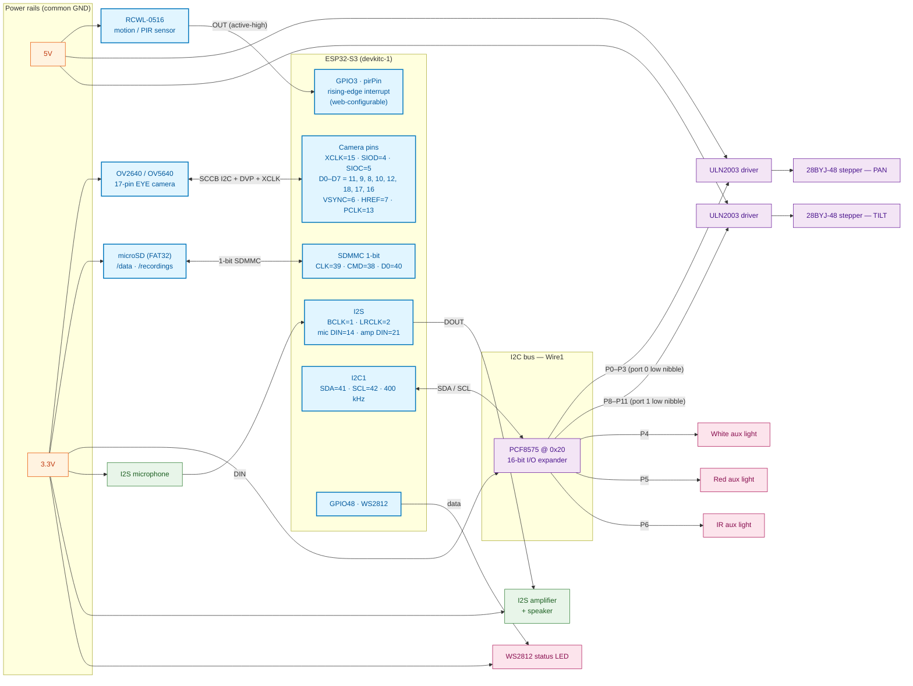

# ESP32-S3-CAM-MJPEG2SD — PTZ Motion-Detection Camera

Self-contained ESP32-S3 surveillance camera: PIR-gated motion detection with PTZ
stepper tracking and MJPEG+audio recording straight to an SD card.

Forked from [s60sc/ESP32-CAM_MJPEG2SD](https://github.com/s60sc/ESP32-CAM_MJPEG2SD),
re-wired for a custom ESP32-S3 board (camera, SD, I2C stepper expander, I2S audio).
TinyML/FOMO object detection from the upstream has been removed; motion detection
uses a pure background-diff algorithm with no ML model.

## How it works

1. An RCWL-0516 motion sensor (GPIO3, web-configured `pirPin`) raises the PIR gate.
2. The camera stays armed for `pirGateArmSecs` seconds; background-diff motion
   detection in `motionDetect.cpp` confirms the trigger.
3. Confirmed motion pans/tilts the 28BYJ-48 steppers toward the object
   (`trackMotionObject()` in `peripherals.cpp`) and starts MJPEG capture to SD.
4. The PIR gate re-arms after `pirGateIdleSecs` of no motion; the camera powers
   down between events.

Optional auxiliary lights (white / red / IR) on the PCF8575 are manually toggled
from the web UI. MQTT + Home Assistant discovery are enabled (`INCLUDE_MQTT`,
`INCLUDE_HASIO`); full upstream feature list in [src/README.md](src/README.md).

## Hardware block diagram



Motor phases use the PCF8575 lower nibbles (mask `0x0F` writes) so the upper
nibbles stay free for the three aux lights; `auxLightPin[0..2]` are PCF8575
pin numbers (0–15) set from the web UI (defaults P4 / P5 / P6). The RCWL-0516
and the two ULN2003 drivers run off 5 V; everything else is 3.3 V. All module
grounds tie back to the ESP32-S3 GND.

## GPIO / wiring reference

| Function | ESP32-S3 GPIO | Notes |
|---|---|---|
| Camera XCLK | 15 | |
| Camera SIOD (SCCB SDA) | 4 | |
| Camera SIOC (SCCB SCL) | 5 | |
| Camera D0–D3 | 11, 9, 8, 10 | |
| Camera D4–D7 | 12, 18, 17, 16 | |
| Camera VSYNC / HREF / PCLK | 6 / 7 / 13 | |
| SD card (1-bit MMC) CLK | 39 | |
| SD card CMD | 38 | |
| SD card D0 | 40 | |
| I2C to PCF8575 SDA / SCL | 41 / 42 | 400 kHz, PCF8575 address `0x20` |
| I2S BCLK (shared mic/amp) | 1 | |
| I2S LRCLK (shared mic/amp) | 2 | |
| I2S mic data in | 14 | |
| I2S amp (speaker) data in | 21 | |
| WS2812 status LED | 48 | |
| RCWL-0516 OUT → | 3 | `pirPin` in web config; `INPUT_PULLDOWN`, RISING interrupt |

Notes:

- All GNDs must be common (camera, PIR, stepper drivers, SD, audio amp).
- RCWL-0516: 3.3–5.5 V supply; OUT is active-high with a multi-second hold
  time, so the firmware edge-triggers rather than level-polls.
- 28BYJ-48 wire color at the ULN2003 (IN1–IN4): blue, pink, yellow, orange;
  the red (center tap) wire is unused. Bipolar motors instead wire A+, A-, B+, B-.
- Flashing uses USB CDC (`ARDUINO_USB_CDC_ON_BOOT=1`), 921600 baud.

## Build & flash

[PlatformIO](https://platformio.org) project. Enabled env:

```
pio run -e esp32s3_devkitc_freenove_cam
pio run -t upload -e esp32s3_devkitc_freenove_cam
pio device monitor -e esp32s3_devkitc_freenove_cam
```

Board: `esp32-s3-devkitc-1`, QSPI OPI PSRAM, 16 MB partition, littlefs.
Camera model define is `CAMERA_MODEL_FREENOVE_ESP32S3_CAM` in
[src/appGlobals.h](src/appGlobals.h); pins live in
[src/camera_pins.h](src/camera_pins.h).

## First boot

1. Insert a FAT SD card (holds `/config` and recordings), connect USB.
2. Join the access point / network, open the web UI.
3. Set `pirPin = 3` and `stepperUse = 1`. With a PCF8575 fitted the pan/tilt
   stepper pins auto-assign to P0–P3 / P8–P11 (no manual pin entry needed);
   `auxLightPin0..2` default to P4 / P5 / P6. Tilt pins are only set manually
   via `step2IN1pin`–`step2IN4pin` when driving steppers directly off GPIOs.
4. Save — settings persist across reboots.

## Fork changes vs upstream

- **TinyML/FOMO removed** (2026-09): `Person_detection_FOMO_inferencing`
  library, FOMO config keys (`mlUse`, `mlProbability`, `mlTrackClass`,
  `trackRecenterSecs`) and all `#if INCLUDE_TINYML` paths deleted. Motion
  detection in `motionDetect.cpp` is now a stand-alone background-diff detector;
  `trackMotionObject()` in `peripherals.cpp` no longer branches on an ML model.
- **Custom hardware branch**: `CAMERA_MODEL_FREENOVE_ESP32S3_CAM` /
  `CAMERA_MODEL_ESP32_S3_CAM` pins in `camera_pins.h` (EYE-style camera
  header, 1-bit SD on 39/38/40, I2S shared clocks, PCF8575 I2C expander,
  WS2812 on GPIO48).
- **PTZ tracking**: two 28BYJ-48 steppers (pan/tilt) driven full-step from
  hardware timers through ULN2003s on a PCF8575, with accumulated position
  tracking for Home Assistant cover-style feedback (`stepperPan`, `stepperTilt`,
  `panSetPos`, `tiltSetPos`, `stepperZero`).
- **PIR gating**: `pirGate` requires PIR trigger plus motion confirmation to
  start recording; `pirGateArmSecs` / `pirGateIdleSecs` /
  `pirGatePostRecSecs` / `pirGateBootIdleSecs` tune the sleep window.
- **I2S audio**: shared BCLK/LRCLK for the I2S microphone and I2S amp in
  `audio.cpp` so recordings carry both video and sound.

Upstream feature documentation: [src/README.md](src/README.md)
(kept in `src/` so it stays next to the code it documents and so upstream
deltas stay visible when merging).
